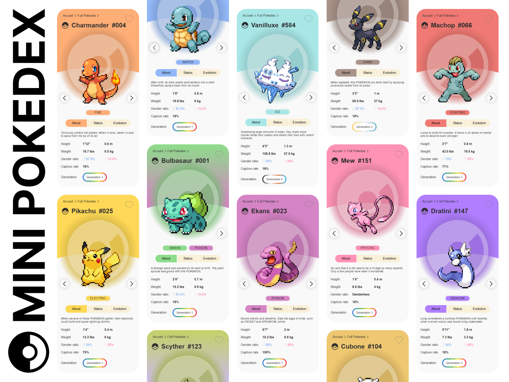
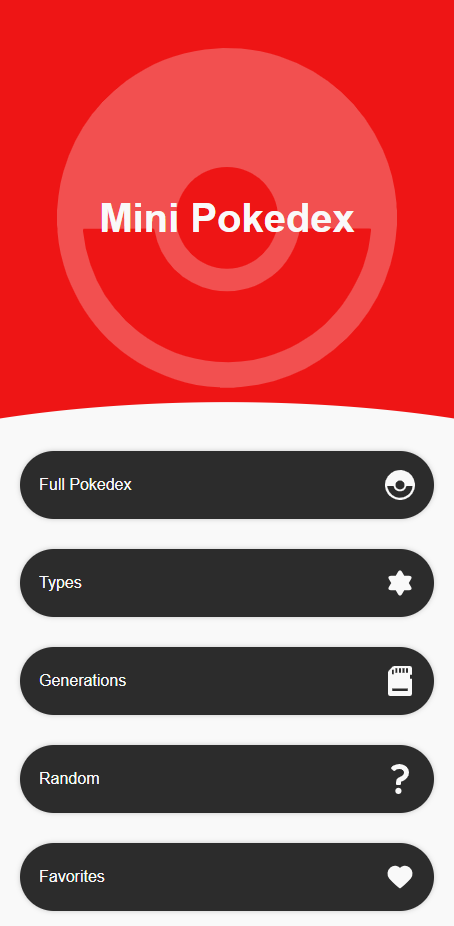
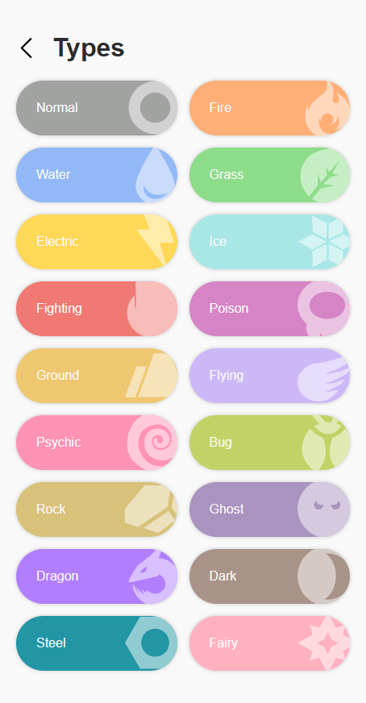
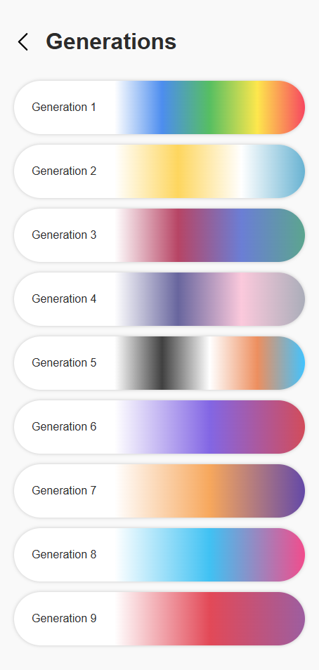
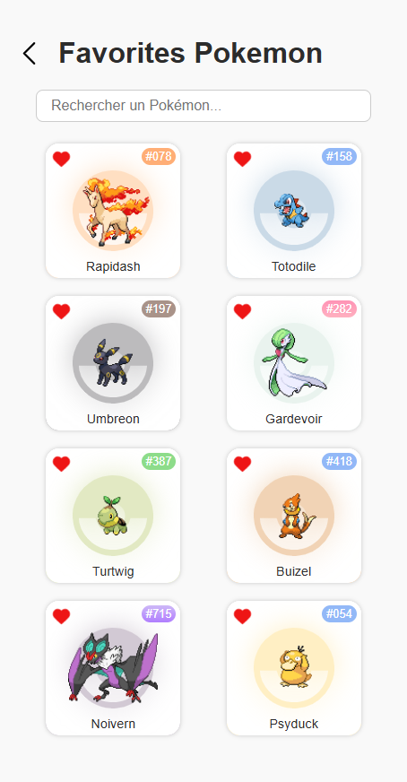
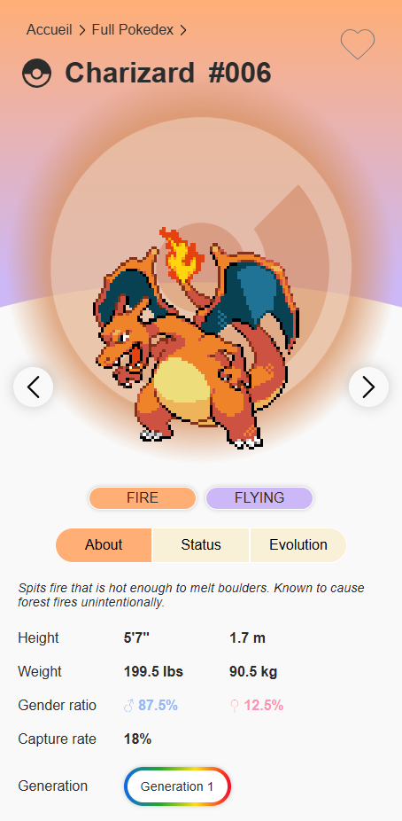

# 🎮 Mini Pokedex (React)

## **🌐 [Voir le projet](https://mini-pokedex-six.vercel.app/)**

Un projet React moderne permettant de parcourir le pokédex Pokémon : exploration par types, générations, aléatoire et gestion de favoris. 🌿🔥💧

## 🚀 Fonctionnalités

- ⚙️ Affichage complet du Pokédex (données issues de [PokeAPI](https://pokeapi.co))
- 📂 Catégories par **type**, **génération**, **sélection alétoire** et **favoris**
- 🧭 Navigation intelligente entre les Pokémon (conserve le contexte de la liste)
- 🔍 Recherche de Pokémon par nom ou numéro
- ❤️ Gestion des favoris (stockés dans `localStorage`)
- 🎴 Interface responsive et légère

## 📷 Aperçus

    
    
    
    
    

## 🛠️ Technologies utilisées

- [React](https://reactjs.org/)
- [React Router](https://reactrouter.com/)
- [PokeAPI](https://pokeapi.co/)
- CSS
- `localStorage` (persistance des favoris)

## 🎨 Design & inspirations

L'interface est **inspirée du travail de Maria Julia Barbieri**, visible ici sur Behance :  
👉 [Pokedex UI Study – par Maria Julia Barbieri](https://www.behance.net/gallery/146710797/Pokedex-Ui-Study)

Elle a conçu un magnifique design mobile que j’ai librement **adapté à ma manière**, en imaginant également une version **responsive pour écran laptop/desktop**.

Cela m'a permis de travailler :
- l'**adaptation d'un design mobile-first** à une expérience plus large
- l'**autonomie dans la création d’une UI cohérente**
- la **mise en œuvre technique avec React et CSS**

## 👋 À propos de moi
- 📧 Email : [lilian.sinsau@gmail.com](mailto:lilian.sinsau@gmail.com)
- 🔗 LinkedIn : [Lilian Sinsau](https://www.linkedin.com/in/lilian-sinsau)
- 📁 Portfolio : [lilian-sinsau.atwebpages.com/](http://lilian-sinsau.atwebpages.com/)